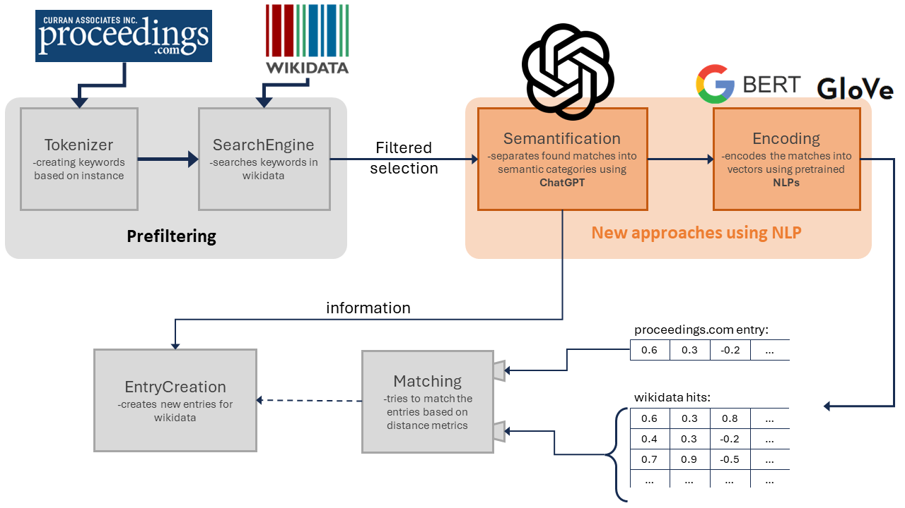
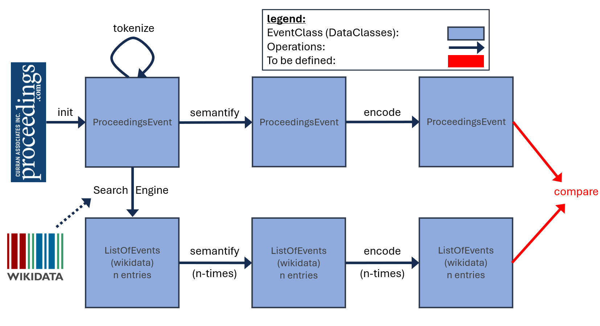

# kg-lab-ws23-task3
Knowledge Graph Lab 💡 - winter semester 2023 - task 3


This repository embodies an approach of identifying scientific events such as conferences and workshops from [proceedings.com](https://www.proceedings.com/) and assign it to its corresponding entry on Wikidata. Missing properties on Wikidata will be added or a new event will be generated if it doesn't exist on Wikidata yet.

[](https://github.com/olafbombach/kg-lab-ws23-task3/commits/main)
[](https://github.com/olafbombach/kg-lab-ws23-task3/issues)
[](https://github.com/olafbombach/kg-lab-ws23-task3/issues/?q=is%3Aissue+is%3Aclosed)

[](https://github.com/olafbombach/kg-lab-ws23-task3/actions/workflows/python-package.yml)

## Use Case Scenario
Situation:

We want to add the data of a conference from [proceedings.com](https://www.proceedings.com/) to Wikidata, but we don't know if it already has an entry in Wikidata. Furthermore its data format is not always suitable for property generation.

Action:
<ul>
<li>Identify potential entries in Wikidata corresponding to our conference.
<li>Convert our entry and its potential candidates into a uniform format using Chat-GPT.
<li>Decide wether or not any of the candidates correspond to our conference using Large Language Models.
<li>Update or generate the Wikidata entry.
</ul>

Expected Result:

Our conference receives a Wikidata entry which contains all its relevant properties.

## Current status of the project:
<ul> 
    <li> Assessment of current Wikidata status &#x2713; </li>
    <li> Preprocessing of queries &#x2713; </li>
    <il> (Method for encoding established) &#x2713; </il>
    <li> Validation of LLM (check for accuracy and precision) &#x2713; </li>
    <li> (Further methods of assignments established) ❌ </li>
    <li> Method for data transfer to Wikidata &#x1F6E1; </li>
    <li> Establishment of an automated method &#x1F6E1; </li>
    <li> Validation of the method &#x1F6E1; </li>
</ul>

## Deadlines

- 2024-01-19: Midterm coordination &#x2713;
- 2024-03-22: Project result delivery
- 2024-03-29: Final presentation

## Usage
<b><big>First setup:</big></b>
- Clone repository
```bash
git clone https://github.com/olafbombach/kg-lab-ws23-task3
```
- Run script
```bash
. scripts/run.sh
```

<b><big>General usage:</big></b>
```bash
esc -h
```

## Why?
This task is part of the practical lab (KG Lab) presented by the Chair of Databases and Information Systems [(i5)](https://dbis.rwth-aachen.de/dbis/) of RWTH Aachen.

## How to contribute to this project:
Thank you for your interest in contributing to this project! We welcome all kinds of contributions, no matter how small or big they are. Whether it's adding new features, fixing bugs, improving documentation, or suggesting new ideas.
In this regard, please follow our [Code of Conduct](.github/CONTRIBUTION.md)

## Considered pipeline


## Code workflow (v2)

