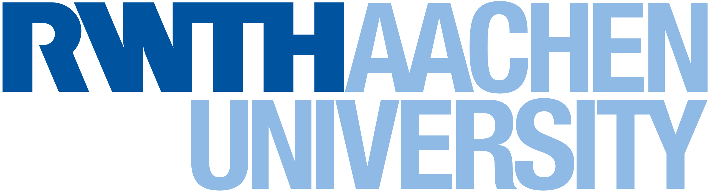

# kg-lab-ws23-task3
Knowledge Graph Lab 💡 - winter semester 2023 - task 3



This repository embodies an approach of identifying event series for scientific events such as conferences and workshops. The unstructured event data is queried from [dblp](https://dblp.org/) and assigned to the correct event series using the code provided here. After correctly assigning the event series, the property of event series is added to the KG of Wikidata.

[](https://github.com/olafbombach/kg-lab-ws23-task3/commits/main)
[](https://github.com/olafbombach/kg-lab-ws23-task3/issues)


## Current status of the project:
<ul> 
    <li> Assessment of current KG status ❌ </li>
    <li> Preprocessing of queries ❌ </li>
    <il> (Method for encoding established) ❌ </il>
    <li> Validation of LLM (check for accuracy and precision) ❌ </li>
    <li> (Further methods of assignments established) ❌ </li>
    <li> Method for data transfer to the KG ❌ </li>
    <li> Establishment of an automated method ❌ </li>
    <li> Validation of the method ❌ </li>
</ul>

## How to install the repository in your workspace:
```bash
git clone https://github.com/olafbombach/kg-lab-ws23-task3
```

## Why?
This task is part of the practical lab (KG Lab) presented by the Chair of Databases and Information Systems [(i5)](https://dbis.rwth-aachen.de/dbis/) of RWTH Aachen.

## How to contribute to this project:
Thank you for your interest in contributing to this project! We welcome all kinds of contributions, no matter how small or big they are. Whether it's adding new features, fixing bugs, improving documentation, or suggesting new ideas.
In this regard, please follow our Code of Conduct:
1. <b>Fork the Repository:</b> Click the "Fork" button on the GitHub repository's page, which will create a copy of the project in your GitHub account.

2. <b>Clone Your Fork:</b> In your local development environment, clone your fork using the following command:
```bash
git clone https://github.com/yourusername/your-fork.git
```

3. <b>Create a Feature Branch:</b> Create a new branch for your feature, bug fix, or improvement:
```bash
git checkout -b feature/your-feature
```
Name your branch appropriately, so it's clear what your changes are about.

4. <b>Make Changes:</b> Make your changes, add new features, fix bugs, or make improvements. Ensure that your code adheres to our coding standards (see "Coding Standards" below).

5. <b>Commit Your Changes:</b> Commit your changes to your branch:
```bash
git commit -m "Description of your changes"
```

6. <b>Push to Your Fork:</b> Push your changes to your GitHub fork:
```bash
git push origin feature/your-feature
```

7. <b>Open a Pull Request:</b> Go to the original repository on GitHub and create a pull request. Include a detailed description of your changes, and reference any related issues.

8. <b>Review and Discussion:</b> Expect feedback and discussions about your pull request. Make any necessary changes based on the feedback.

9. <b>Approval and Merge:</b> Once your pull request is approved by a project maintainer, it will be merged into the main project.

10. <b>Cleanup:</b> After your pull request is merged, you can delete your branch.
